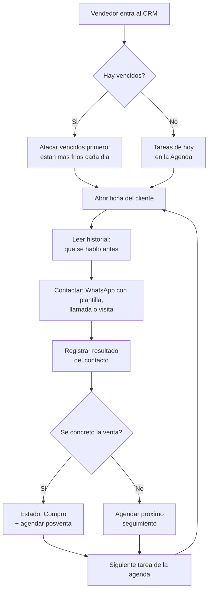
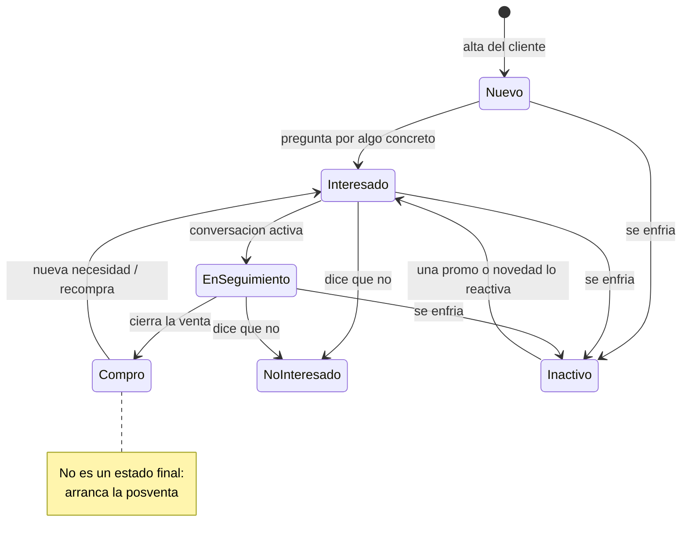
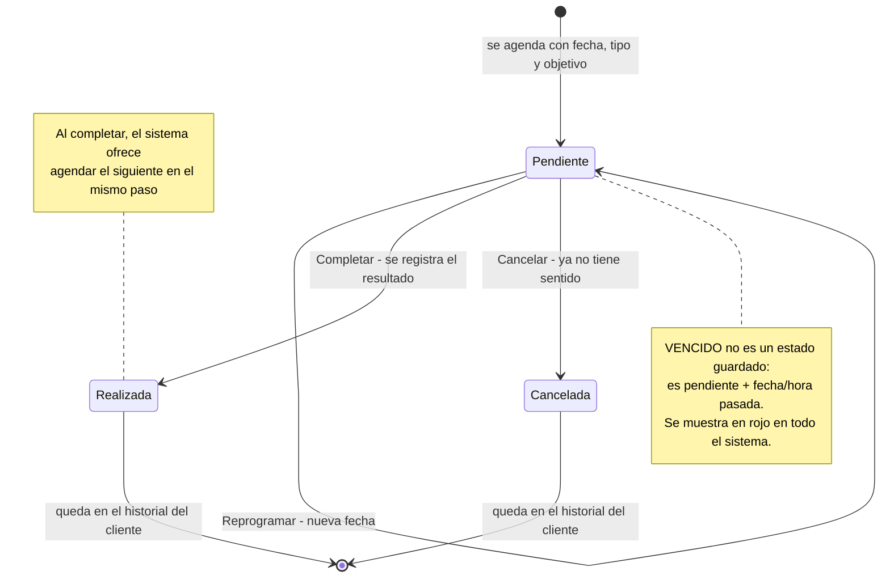
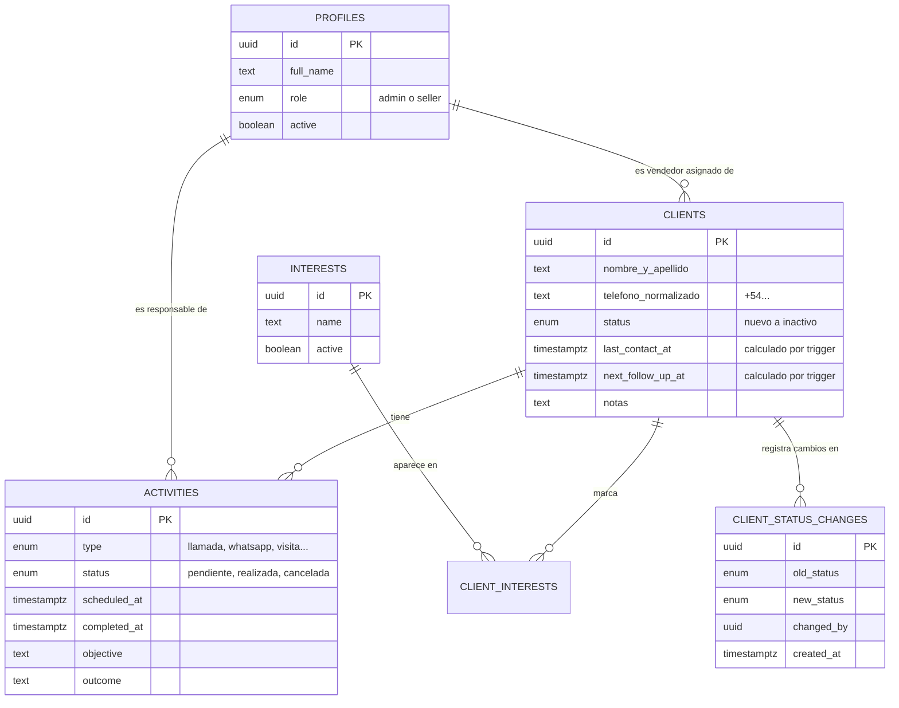
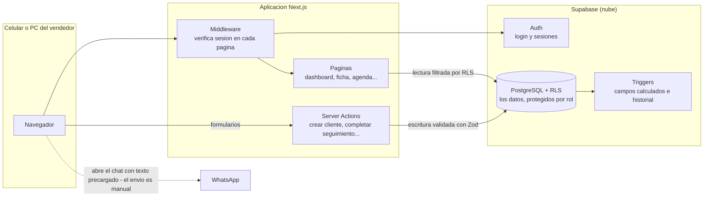

# Diagramas del sistema — CRM Mueblería El Gallego

Complemento visual de [informe-sistema.md](informe-sistema.md). GitHub renderiza estos diagramas automáticamente.

---

## 1. El día del vendedor (flujo de trabajo principal)

Este es el circuito que el sistema le propone a cada vendedor todos los días. La regla central: ninguna conversación termina sin registro y sin próximo paso.

## 2. Ciclo de vida del cliente (estados comerciales)

El estado es la "foto" de la relación. Cambia cuando cambia la realidad, y cada cambio queda registrado automáticamente en el historial.

## 3. Ciclo de un seguimiento (actividad)

Una sola tabla alimenta la agenda y el historial: la actividad pendiente ES la agenda; al completarse pasa a ser historial.

## 4. Modelo de datos (qué se relaciona con qué)

Detalles que no se ven en el gráfico:
- **Triggers automáticos**: al crear/completar/cancelar una actividad se recalculan `last_contact_at` y `next_follow_up_at` del cliente; al cambiar el estado de un cliente se inserta la fila en `client_status_changes`; al crearse un usuario en Auth se crea su perfil.
- **RLS (seguridad)**: todas las tablas exigen que el que consulta sea el vendedor dueño del cliente o admin. Se cumple en la base, no en la pantalla.

## 5. Arquitectura (cómo viaja un pedido)

---

**Cómo verlos**: en GitHub se renderizan solos al abrir este archivo. En VS Code, instalá la extensión "Markdown Preview Mermaid Support" y usá la vista previa (Ctrl+Shift+V).
